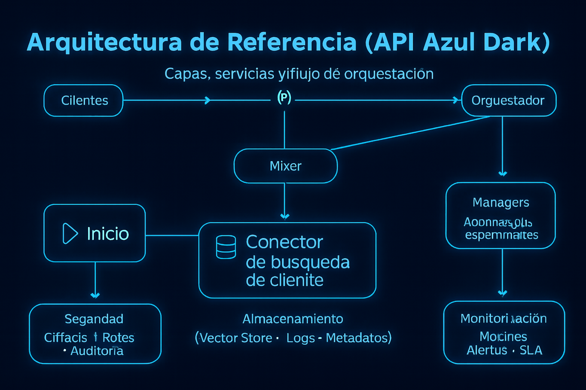

  

<h1 align="center">AIDEN API Azul Dark</h1>

<strong>AIDEN — Inteligencia Artificial Latina</strong>

---

## Descripción ejecutiva
**AIDEN API Azul Dark** es el plano corporativo del ecosistema AIDEN: integración segura vía API (REST/SSE/WebSocket), enrutamiento de modelos, agentes **Managers**, proyectos multi‑módulo **Mixer**, controles de costo y cumplimiento. Es un producto **real en evolución**: listo para pilotos y escalamiento controlado.

- **Casos de uso**: automatización de conocimiento, copilotos internos, generación de documentos y código, analítica guiada, voice ops, back‑office IA.
- **Interfaz**: API + SDKs.
- **Seguridad**: cifrado, RBAC/ABAC, auditorías, residencias de datos.
- **Modelos**: selección entre **AIDEN Core** y **AIDEN Azul Deep (Premium)** según costo/latencia/contexto.

---

## Arquitectura (visión ejecutiva)
Visual interactivo (HTML) y SVG: 

La arquitectura de **AIDEN API Azul Dark** se fundamenta en un diseño modular y escalable que permite administrar, enrutar y ejecutar múltiples modelos de IA dentro de un mismo ecosistema seguro. Cada componente ha sido desarrollado bajo criterios de resiliencia, disponibilidad y optimización de costos, garantizando un flujo estable de peticiones tanto en entornos empresariales como en pruebas controladas. La visión ejecutiva de esta arquitectura es permitir que cualquier organización, desde startups hasta corporaciones, pueda integrar las capacidades cognitivas de AIDEN de forma directa y flexible mediante API, sin requerir infraestructura adicional o conocimiento profundo en machine learning.

  

**Componentes clave**
- **Gateway & WAF** con **rate limiting** por rol/proyecto.
- **Orquestador** (colas/jobs) + **Model Router** (selección dinámica).
- **Managers** (agentes) y **Mixer** (proyectos compuestos).
- Observabilidad, auditoría y **storage cifrado**.

---

## Guía de integración (resumen)
- `docs/assets/integration.html`
- `docs/assets/integration-flow.svg`

El proceso de integración con **AIDEN API Azul Dark** ha sido diseñado para ser intuitivo y rápido, priorizando la simplicidad del onboarding y la eficiencia en la implementación. Los desarrolladores o equipos técnicos solo necesitan registrar una aplicación, obtener su clave API y comenzar a interactuar con los endpoints disponibles. El flujo estándar permite iniciar en modo sandbox y luego escalar a producción con total trazabilidad, asegurando que cada interacción esté controlada, registrada y asociada a métricas de costo y uso. Esta guía resume los pasos esenciales para integrar los servicios de voz, texto e imagen, abriendo el acceso a un ecosistema robusto y personalizable.

  

**Flujo base**
1. Registrar aplicación y crear **API Key**.  
2. Enviar solicitud a `/v1/chat` o `/v1/speech` (stream opcional).  
3. Recibir **webhooks** (estados/costos/errores).  
4. Promover **sandbox → producción** con monitoreo activo.

---

## Seguridad y cumplimiento
- `docs/assets/security.html`
- `docs/assets/security-schema.svg`

**AIDEN API Azul Dark** está construido con un enfoque de seguridad “por diseño”, integrando cifrado avanzado, autenticación basada en roles (RBAC/ABAC) y auditorías completas en todos los niveles. Los datos viajan cifrados en tránsito (TLS) y se almacenan bajo políticas AES-256 en reposo, con rotación automática de claves y opciones de residencia de datos según la jurisdicción del cliente. Además, el sistema implementa controles de privacidad y anonimización (PII masking), junto con mecanismos de retención programable y cumplimiento con estándares globales. La prioridad es ofrecer a las organizaciones un entorno confiable y conforme a las regulaciones de seguridad internacionales.

  

**Controles**
- TLS (en tránsito), AES‑256 (en reposo), rotación de claves.  
- **RBAC/ABAC**, firmas de webhook, PII masking, data‑residency.  
- Auditoría y retención programable.

---

## Endpoints (alto nivel)

Los endpoints de **AIDEN API Azul Dark** representan el núcleo funcional de todo el ecosistema. Cada uno ha sido diseñado para ofrecer una operación específica dentro del flujo de inteligencia artificial: mensajería contextual, entrada de voz, generación de imágenes, administración de agentes (Managers) y composición de proyectos (Mixer). Las rutas están optimizadas para mantener equilibrio entre velocidad, costo y control granular, permitiendo que cada cliente escale su propia infraestructura cognitiva bajo un modelo “plug and play”. Con métricas detalladas y límites configurables, el sistema garantiza rendimiento predecible y transparencia operativa.

| Endpoint | Método | Descripción |
|---|---|---|
| `/v1/chat` | POST | Mensajería y razonamiento (stream SSE/WS opcional). |
| `/v1/speech` | POST | Entrada de voz y TTS con control de prosodia. |
| `/v1/images` | POST | Generación/edición de imágenes con políticas. |
| `/v1/managers` | POST/GET | Configuración y ejecución de agentes. |
| `/v1/mixer` | POST | Creación de proyectos compuestos. |
| `/v1/usage` | GET | Métricas, costos y límites por API key. |

**Auth**: `Authorization: Bearer <API_KEY>`  
**Límites iniciales**: 60 req/min; 3 MB/min audio; 25 MB imagen.  

---

## SLA & planes corporativos
| Plan | SLA | Soporte | Capacidad | Personalización |
|---|---|---|---|---|
| Enterprise | 99.9% | Dedicado | Alto | SDKs, webhooks, residencias |
| Unlimited | 99.95% | TAM | Muy alto | On‑prem opc., ruteo avanzado |

---

## Monetización y proyección (resumen)

| Año | Ingresos Totales Estimados (USD) | Etapa |
|---|---:|---|
| 2027 (H2) | 14.55M | Monetización inicial API + upsell |
| 2028 | 86.0M | Escalamiento y expansión |
| 2029–2030 | 125.5M | Consolidación global |

---

## Comparativa (alto nivel) 

En esta comparativa se destacan las diferencias entre las tres versiones del ecosistema AIDEN: **AIDEN Core**, **AIDEN Azul Deep** y **AIDEN API Azul Dark**. Mientras Core representa el entorno base de uso general, Azul Deep incorpora mayor capacidad de contexto y procesamiento premium; Azul Dark, en cambio, es la versión corporativa, diseñada para entornos empresariales de alta demanda, con auditoría avanzada, residencias de datos y ruteo inteligente de modelos. Esta visión comparativa permite a los socios y potenciales inversionistas comprender cómo cada capa de AIDEN se adapta a distintos escenarios de negocio, desde soluciones creativas hasta infraestructuras de IA empresarial a gran escala.

| Capacidad | AIDEN API Azul Dark | AIDEN Azul Deep | AIDEN Core |
|---|---|---|---|
| Contexto | Muy alto (hasta 1M tokens) | Alto (hasta 500K) | Medio (hasta 32K) |
| Modalidades | Voz, texto, imágenes | Voz, texto, imágenes | Voz y texto |
| Managers | Avanzado + RBAC | Intermedio | Básico |
| Mixer | Pipelines enterprise | Proyectos creativos/pro | — |
| Seguridad | Auditoría, residencias | Cifrado estándar | Cifrado estándar |

---

## Alianzas estratégicas potenciales
AIDEN API Azul Dark avanza hacia una red global de **socios estratégicos** manteniendo independencia tecnológica y liderazgo desde **Latinoamérica**.

| Categoría | Socios potenciales |
|---|---|
| Nube/Infra | Google Cloud, AWS, Microsoft Azure, Oracle, Huawei Cloud |
| Observabilidad/Sec | Datadog, New Relic, Splunk, Snyk, HashiCorp |
| Datos/MLOps | Snowflake, Databricks, Airflow, Prefect, DBT |
| Telecom/Edge | Telefónica, Claro, Verizon, Equinix |

---

## Recursos
- Arquitectura (HTML): `docs/assets/architecture.html`  
- Integración (HTML): `docs/assets/integration.html`  
- Seguridad (HTML): `docs/assets/security.html`  
- Roadmap (HTML): `docs/assets/roadmap.html`

---

### Licencia y contacto
Código del repositorio bajo **MIT**. El uso comercial de modelos/servicios requiere **autorización expresa** de **JMC Studio Creativo**.  
**Contacto**: contacto@jmcstudiocreativo.com

© 2025 JMC Studio Creativo — AIDEN IA Latina. Todos los derechos reservados. Desarrollado en Guayaquil, Ecuador.
