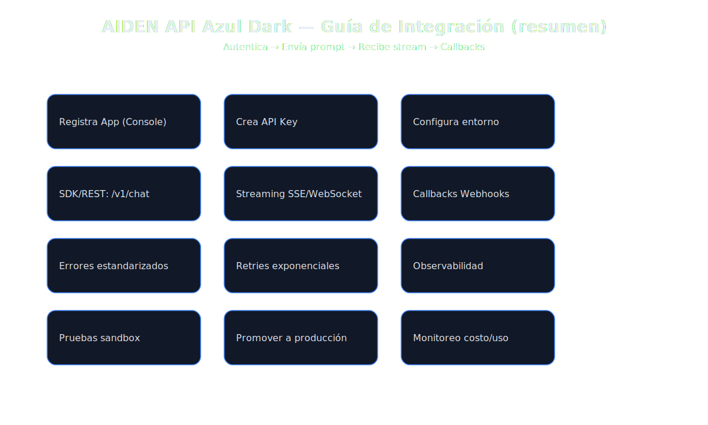
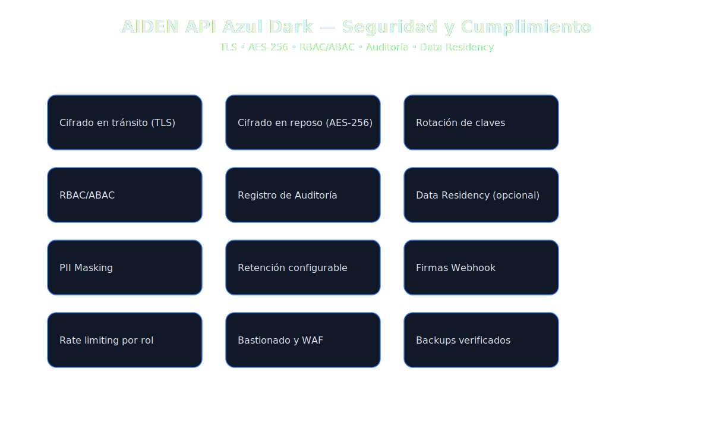

  

<h1 align="center">AIDEN API Azul Dark</h1>

<strong>AIDEN — Inteligencia Artificial Latina</strong>

---

## Descripción ejecutiva
**AIDEN API Azul Dark** es el plano corporativo del ecosistema AIDEN: integración segura vía API (REST/SSE/WebSocket), enrutamiento de modelos, agentes **Managers**, proyectos multi‑módulo **Mixer**, controles de costo y cumplimiento. Es un producto **real en evolución**: listo para pilotos y escalamiento controlado.

- **Casos de uso**: automatización de conocimiento, copilotos internos, generación de documentos y código, analítica guiada, voice ops, back‑office IA.
- **Interfaz**: API + SDKs.
- **Seguridad**: cifrado, RBAC/ABAC, auditorías, residencias de datos.
- **Modelos**: selección entre **AIDEN Core** y **AIDEN Azul Deep (Premium)** según costo/latencia/contexto.

---

## Arquitectura (visión ejecutiva)
Visual interactivo (HTML) y SVG:

  

**Componentes clave**
- **Gateway & WAF** con **rate limiting** por rol/proyecto.
- **Orquestador** (colas/jobs) + **Model Router** (selección dinámica).
- **Managers** (agentes) y **Mixer** (proyectos compuestos).
- Observabilidad, auditoría y **storage cifrado**.

---

## Guía de integración (resumen)
- `docs/assets/integration.html`
- `docs/assets/integration-flow.svg`

  

**Flujo base**
1. Registrar aplicación y crear **API Key**.  
2. Enviar solicitud a `/v1/chat` o `/v1/speech` (stream opcional).  
3. Recibir **webhooks** (estados/costos/errores).  
4. Promover **sandbox → producción** con monitoreo activo.

---

## Seguridad y cumplimiento
- `docs/assets/security.html`
- `docs/assets/security-schema.svg`

  

**Controles**
- TLS (en tránsito), AES‑256 (en reposo), rotación de claves.  
- **RBAC/ABAC**, firmas de webhook, PII masking, data‑residency.  
- Auditoría y retención programable.

---

## Endpoints (alto nivel)
| Endpoint | Método | Descripción |
|---|---|---|
| `/v1/chat` | POST | Mensajería y razonamiento (stream SSE/WS opcional). |
| `/v1/speech` | POST | Entrada de voz y TTS con control de prosodia. |
| `/v1/images` | POST | Generación/edición de imágenes con políticas. |
| `/v1/managers` | POST/GET | Configuración y ejecución de agentes. |
| `/v1/mixer` | POST | Creación de proyectos compuestos. |
| `/v1/usage` | GET | Métricas, costos y límites por API key. |

**Auth**: `Authorization: Bearer <API_KEY>`  
**Límites iniciales**: 60 req/min; 3 MB/min audio; 25 MB imagen.  

---

## SLA & planes corporativos
| Plan | SLA | Soporte | Capacidad | Personalización |
|---|---|---|---|---|
| Enterprise | 99.9% | Dedicado | Alto | SDKs, webhooks, residencias |
| Unlimited | 99.95% | TAM | Muy alto | On‑prem opc., ruteo avanzado |

---

## Monetización y proyección (resumen)

| Año | Ingresos Totales Estimados (USD) | Etapa |
|---|---:|---|
| 2027 (H2) | 14.55M | Monetización inicial API + upsell |
| 2028 | 86.0M | Escalamiento y expansión |
| 2029–2030 | 125.5M | Consolidación global |

---

## Comparativa (alto nivel)
| Capacidad | AIDEN API Azul Dark | AIDEN Azul Deep | AIDEN Core |
|---|---|---|---|
| Contexto | Muy alto (hasta 1M tokens) | Alto (hasta 500K) | Medio (hasta 32K) |
| Modalidades | Voz, texto, imágenes | Voz, texto, imágenes | Voz y texto |
| Managers | Avanzado + RBAC | Intermedio | Básico |
| Mixer | Pipelines enterprise | Proyectos creativos/pro | — |
| Seguridad | Auditoría, residencias | Cifrado estándar | Cifrado estándar |

---

## Alianzas estratégicas potenciales
AIDEN API Azul Dark avanza hacia una red global de **socios estratégicos** manteniendo independencia tecnológica y liderazgo desde **Latinoamérica**.

| Categoría | Socios potenciales |
|---|---|
| Nube/Infra | Google Cloud, AWS, Microsoft Azure, Oracle, Huawei Cloud |
| Observabilidad/Sec | Datadog, New Relic, Splunk, Snyk, HashiCorp |
| Datos/MLOps | Snowflake, Databricks, Airflow, Prefect, DBT |
| Telecom/Edge | Telefónica, Claro, Verizon, Equinix |

---

## Recursos
- Arquitectura (HTML): `docs/assets/architecture.html`  
- Integración (HTML): `docs/assets/integration.html`  
- Seguridad (HTML): `docs/assets/security.html`  
- Roadmap (HTML): `docs/assets/roadmap.html`

---

### Licencia y contacto
Código del repositorio bajo **MIT**. El uso comercial de modelos/servicios requiere **autorización expresa** de **JMC Studio Creativo**.  
**Contacto**: contacto@jmcstudiocreativo.com

© 2025 JMC Studio Creativo — AIDEN IA Latina. Todos los derechos reservados. Desarrollado en Guayaquil, Ecuador.
