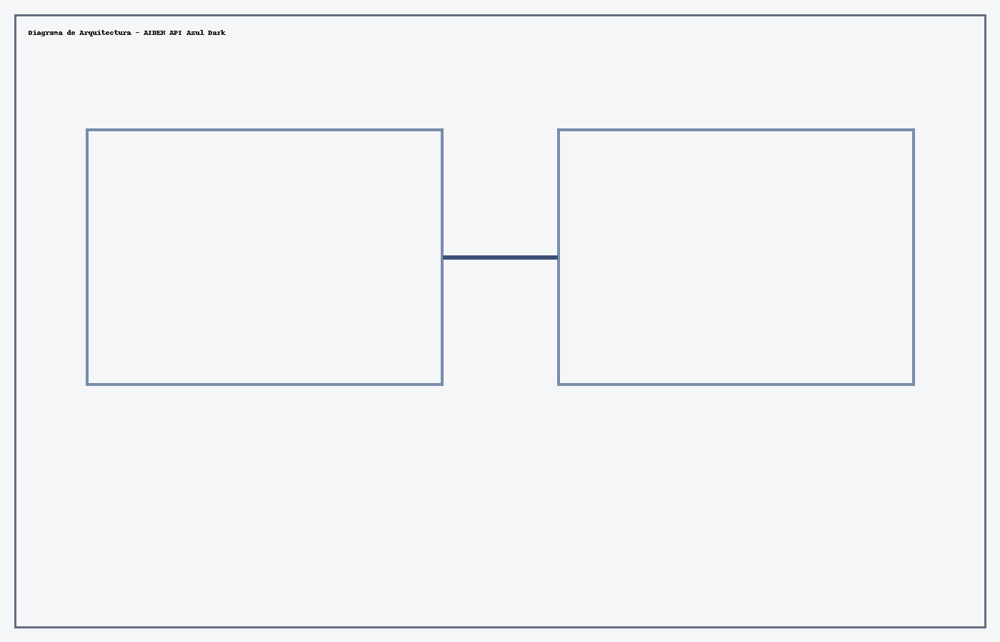
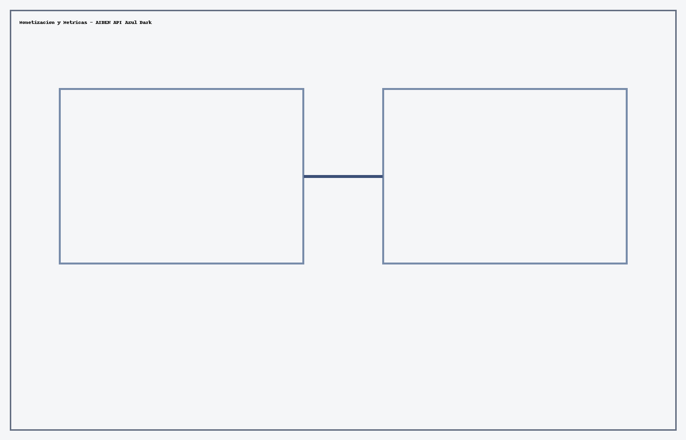
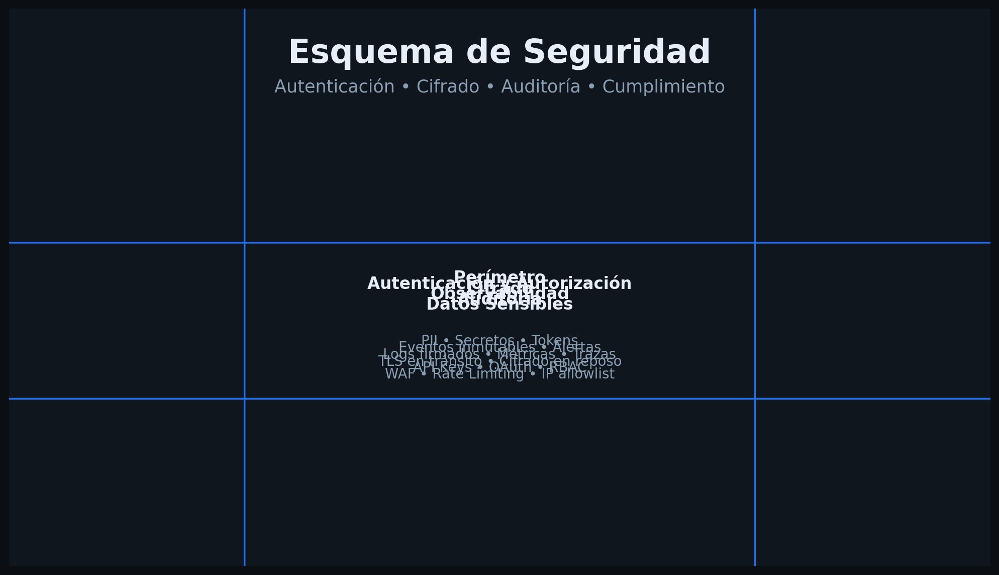
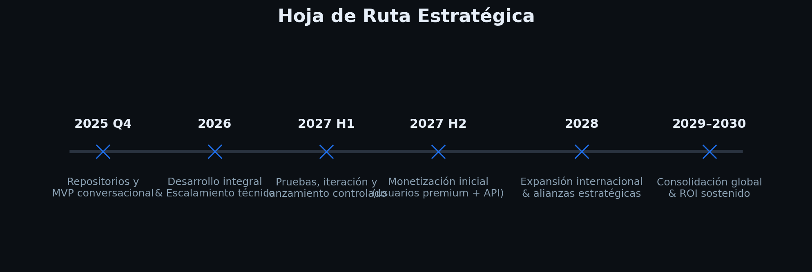

  

<h1 align="center">AIDEN API Azul Dark</h1>

<b>AIDEN — Inteligencia Artificial Latina</b>

---

AIDEN API Azul Dark es la capa <b>corporativa</b> del ecosistema AIDEN. Provee capacidades de <b>IA conversacional por voz y texto</b>, razonamiento avanzado, búsqueda con síntesis, generación de código y orquestación con <b>Managers</b> (asistentes especializados) y <b>Mixer</b> (proyectos multi‑módulo), todo expuesto vía <b>API REST</b> y SDKs. Está diseñado para <b>empresas, gobiernos y startups</b> que requieren <b>seguridad, escalabilidad, observabilidad y cumplimiento</b>.

<blockquote>Nota estratégica: Este repositorio describe el estado actual del modelo API y su <b>ruta de evolución</b>. El producto es real, está en desarrollo activo y su alcance funcional crecerá de forma iterativa con métricas y adopción.</blockquote>

## Arquitectura (visión ejecutiva)
- <b>Interfaz</b>: REST/JSON, Webhooks, claves por proyecto, límites y cuotas configurables.
- <b>Orquestación</b>: Managers (agentes configurables) y Mixer (pipelines de proyectos) como módulos activables.
- <b>Rendimiento</b>: Contexto ampliado; colas de inferencia y batching; caché semántica en caliente.
- <b>Seguridad</b>: IAM por organización, claves de transferencia rotativas, cifrado en tránsito y en reposo.
- <b>Observabilidad</b>: Trazas por request, panel de costos, tokens y latencias por endpoint.
- <b>Cumplimiento</b>: Controles de datos y privacidad orientados a sectores regulados.

  

## Capacidades principales
- <b>Conversación por voz y texto</b> con control de tono, prosodia y estilo.
- <b>Razonamiento y planificación</b> con búsqueda y síntesis de fuentes.
- <b>Generación técnica</b>: código, documentos, reportes, arte conceptual.
- <b>Managers</b>: agentes configurables por rol, dominio y políticas.
- <b>Mixer</b>: creación de proyectos multi‑módulo por voz o prompt.
- <b>Gobernanza</b>: control de versiones, rate limiting, auditoría y presupuestos.

## Guía de integración (resumen)
1. <b>Autenticación</b>: token por organización y proyecto.
2. <b>Llamadas</b>: <code>/v1/chat.completions</code>, <code>/v1/speech</code>, <code>/v1/images</code>, <code>/v1/projects</code> (Mixer), <code>/v1/agents</code> (Managers).
3. <b>Webhooks</b>: <code>events.message.completed</code>, <code>project.updated</code>, <code>audit.log</code>.
4. <b>Trazabilidad</b>: idempotencia por <code>request_id</code>; exportación de métricas.
5. <b>Escalamiento</b>: colas dedicadas y burst capacity bajo demanda.

  

## Modelo de negocio y monetización (síntesis)
- <b>Suscripción Enterprise</b> (desde USD 175/mes por espacio base) con tiers por contexto, voz y cómputo.
- <b>Consumo</b>: precios por 1K tokens (entrada/salida) y por minuto de voz.
- <b>Add‑ons</b>: Managers avanzados, Mixer profesional, entornos dedicados y cumplimiento sectorial.
- <b>Proyección</b>: crecimiento gradual 2027→2030 siguiendo el plan público de AIDEN.

  

## Comparativa estratégica (alto nivel)
| Dimensión | AIDEN API Azul Dark | AIDEN Azul Deep (Premium) | AIDEN Core |
|---|---|---|---|
| Enfoque | Integración empresarial, seguridad, auditoría, escalabilidad | Premium para creadores/equipos | Núcleo base y acompañamiento |
| Interface | REST/SDK/Webhooks | App + SDK | App |
| Voz | Ejecutiva (voz y texto) | Conversacional creativa | Conversación estándar |
| Managers/Mixer | Avanzado + multi‑org | Intermedio | Básico |
| Controles de datos | IAM, auditoría, data residency | Perfiles avanzados | Perfiles estándar |
| SLA | Empresarial | Mejor esfuerzo | Mejor esfuerzo |

## Seguridad y cumplimiento
- <b>IAM</b> por org/equipo/rol, <b>tokens rotativos</b>, scopes por API.
- <b>Auditoría</b> por request y por proyecto; exportación a SIEM del cliente.
- <b>Políticas de retención</b> y anonimización bajo demanda.
- <b>Controles de abuso</b>: límites por tasa, validación de entradas y salidas.

  

## Hoja de ruta 2025–2030 (resumen)
- 2025: hardening y primeros pilotos cerrados.
- 2026: despliegues dedicados, gobernanza avanzada y paquetes sectoriales.
- 2027: monetización ampliada con Mixer/Managers empresariales.
- 2028: expansión internacional y compliance sectorial extendido.
- 2029–2030: consolidación global y optimización de costos.

  

## Alianzas Estratégicas Potenciales
AIDEN API Azul Dark avanza hacia una <b>red global de alianzas</b> con líderes tecnológicos, bajo un modelo de <b>socios</b>, no de dependencia. Nuestro objetivo es que AIDEN, desde Latinoamérica, sea un <b>actor de primer nivel</b> en IA empresarial, interoperando con infraestructuras líderes.

| Categoría | Socios potenciales |
|---|---|
| Nube e infraestructura | Google Cloud, AWS, Microsoft Azure, Oracle Cloud, Huawei Cloud |
| Datos y analítica | Snowflake, Databricks, BigQuery, Redshift |
| Seguridad y cumplimiento | Palo Alto Networks, CrowdStrike, Okta |
| Colaboración | Slack, Microsoft Teams, Zoom |
| Integración y MLOps | Kubernetes, Terraform, Argo, MLflow |

---
<b>Contacto:</b> contacto@jmcstudiocreativo.com  
© 2025 JMC Studio Creativo — AIDEN IA Latina. Todos los derechos reservados. Desarrollado en Guayaquil, Ecuador.
