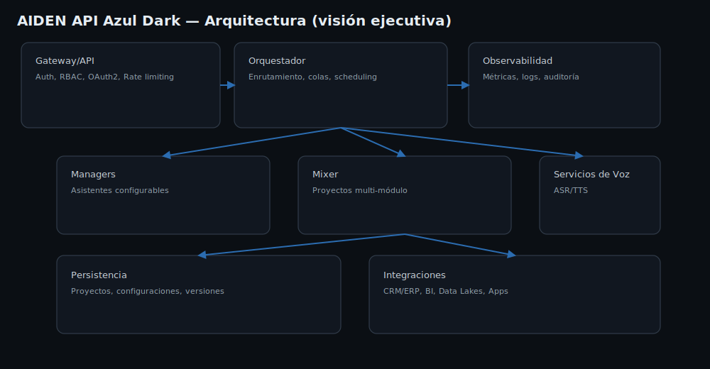
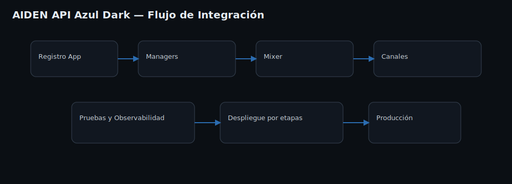
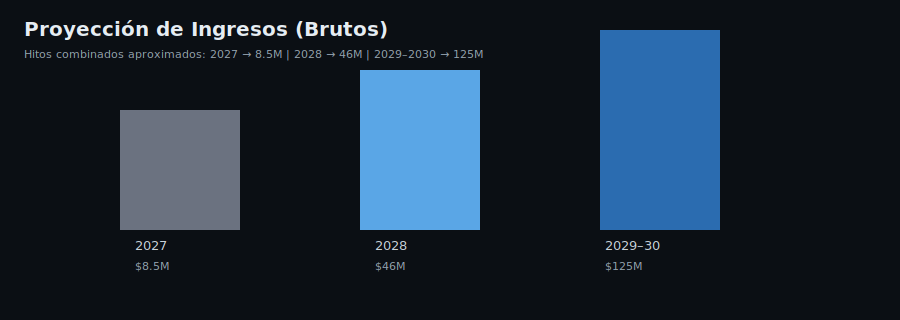
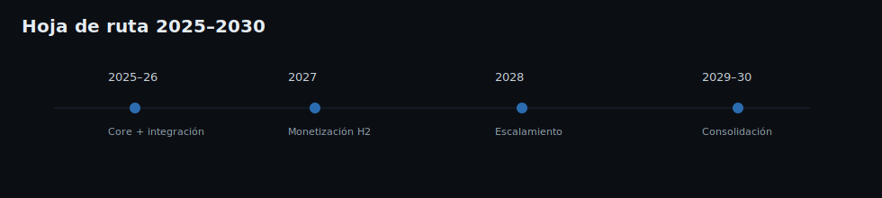

# AIDEN API Azul Dark  
**AIDEN — Inteligencia Artificial Latina**

AIDEN API Azul Dark es el **modelo corporativo y de integración** del ecosistema AIDEN. Su objetivo es habilitar **capacidades de IA conversacional por voz y texto**, orquestación **multi‑módulo** (Managers & Mixer) y **extensiones empresariales** con seguridad avanzada, auditoría y escalabilidad para **uso productivo en organizaciones**.

> Nota: Este repositorio consolida documentación técnica y de negocio. El producto sigue **en desarrollo activo** con un enfoque iterativo (MVP → Beta → GA).

---

## 1) Arquitectura (visión ejecutiva)
Diagrama de alto nivel de la plataforma y el plano de integración (servicios, gateways, módulos).

  

**Componentes clave**
- **Gateway/API**: Autenticación, autorización (RBAC), rate limiting, API keys y OAuth2.
- **Orquestador**: Encola, enruta y coordina solicitudes entre Managers, Mixer y módulos.
- **Managers**: Asistentes configurables (p. ej., redacción, análisis, soporte).
- **Mixer**: Ensambla flujos multi‑módulo (presentaciones, webs, informes, campañas).
- **Servicios de Voz**: Entrada/salida de voz (prosodia, diarización).  
- **Persistencia**: Almacenamiento seguro de configuraciones, proyectos y logs.
- **Observabilidad**: Métricas, tracing, auditoría y dashboards.

---

## 2) Guía de Integración (resumen)
Flujo recomendado para conectar aplicaciones internas y externas con AIDEN API.

  

**Pasos tipo (alto nivel)**
1. **Registro** de aplicación/servicio y emisión de **API Key / OAuth2 client**.
2. **Definir Managers** (roles, parámetros, datasets internos permitidos).
3. **Configurar Mixer** por caso de uso (p. ej., reporte automatizado semanal).
4. **Conectar canales** (web, móvil, CRM/ERP, BI, Data Lake, bots de voz).
5. **Pruebas** de carga y latencia; activar **observabilidad** y alertas.
6. **Despliegue** controlado por etapas (MVP → pilotos → producción).

---

## 3) Seguridad y Cumplimiento
Modelo de seguridad por capas, con trazabilidad y controles de acceso.

  

**Controles esenciales**
- **Identidad y Acceso**: OAuth2/OIDC, API Keys, RBAC/ABAC y rotación de credenciales.
- **Cifrado**: TLS en tránsito; cifrado en reposo para datos y secretos.
- **Privacidad**: Aislamiento por tenant, **data minimization**, retención configurable.
- **Auditoría**: Logs firmados, **inmutables**, exportables a SIEM.
- **Confiabilidad**: SLOs, backups, DR/BCP, pruebas de caos.
- **Cumplimiento**: Controles orientativos para ISO 27001, SOC 2, GDPR/LatAm.

---

## 4) Modelos y Capacidades (resumen)
Comparativa breve para selección empresarial.

| Característica | AIDEN Core | AIDEN Azul Deep (Premium) | AIDEN API Azul Dark |
|---|---:|---:|---:|
| Enfoque | Conversación base | Razonamiento + creatividad | Integración y escalabilidad |
| Ventana de contexto | ~32K | ~500K | ~1M |
| Voz | Sí (básico) | Sí (natural/prosodia) | Sí (ejecutiva y personalizable) |
| Managers | — | Hasta 3/usuario | Ilimitados por tenant |
| Mixer | — | Proyectos predefinidos | Flujos complejos y orquestación |
| Seguridad | Estándar | Avanzada | Empresarial + auditoría |
| Acceso | Web/Móvil | Web/Móvil/Studio | API/SDK/Conectores |

---

## 5) Monetización y Proyección (resumen)

  

**Modelo de ingresos**
- **Suscripción Enterprise**: desde **USD $175/mes** por tenant (capacidad base).
- **Sobrecargos por uso**: voz, contexto extendido, jobs batch, SLO premium.
- **Proyectos a medida** (AIDEN Studio): integraciones y verticalización.

**Hitos proyectados** (alineados a planes previos): 2027 → **$8.5M**, 2028 → **$46M**, 2029–2030 → **$125M** (ingresos brutos aproximados combinados).

---

## 6) Hoja de Ruta 2025–2030 (resumen)
Etapas principales del programa de producto.

  

- **2025–2026**: Consolidación del core y de la capa de integración.  
- **2027**: Monetización inicial (H2), pilotos enterprise, primera ola de partners.  
- **2028**: Escalamiento global LATAM/EE. UU./Europa, verticales regulados.  
- **2029–2030**: Consolidación, optimizaciones y nuevos módulos de voz y datos.

---

## 7) Alianzas Estratégicas Potenciales
AIDEN API Azul Dark avanza hacia una **red global de alianzas estratégicas** con líderes tecnológicos. Buscamos relaciones **de pares y co‑innovación**, evitando dependencias críticas, y reafirmando a **AIDEN como líder latinoamericano** con proyección global.

| Categoría | Potenciales socios |
|---|---|
| Nube e infraestructura | Google Cloud, AWS, Microsoft Azure, Oracle, Huawei Cloud |
| Datos y BI | Snowflake, Databricks, BigQuery, Power BI |
| Seguridad | CrowdStrike, Palo Alto Networks, Okta |
| Contact Center / Voz | Twilio, Vonage, Genesys |
| Integración / iPaaS | MuleSoft, Boomi, Workato |

---

## 8) Licencia y Contacto
Este repositorio de documentación se publica bajo **Licencia MIT**.  
Para uso comercial de modelos o integraciones empresariales, contáctanos.

**Contacto**: contacto@jmcstudiocreativo.com

---

© 2025 JMC Studio Creativo — AIDEN IA Latina. Todos los derechos reservados. Desarrollado en Guayaquil, Ecuador.
